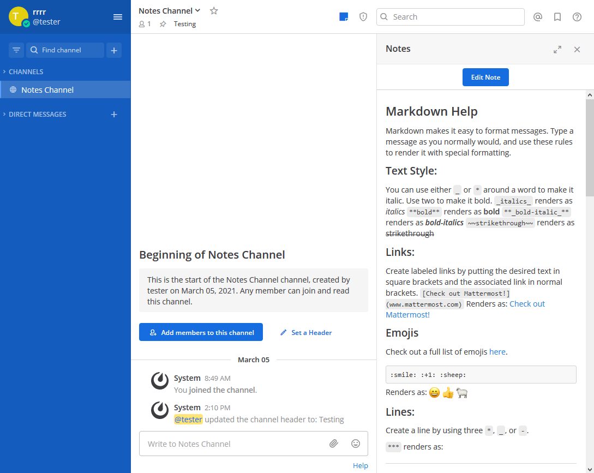
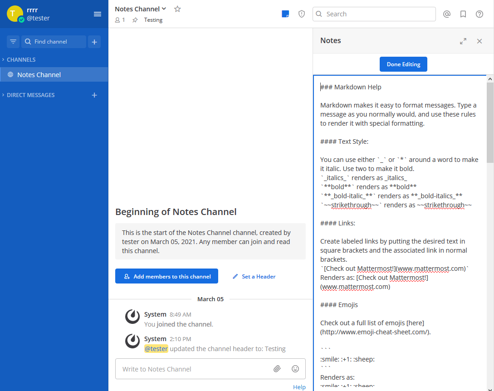
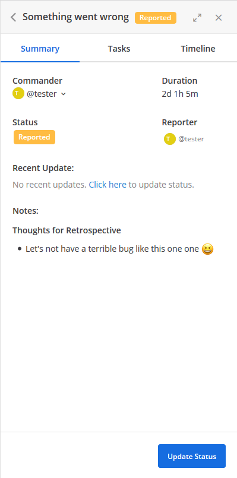

# Mattermost Channel Notes Plugin

A [Mattermost](https://mattermost.com) plugin that extends channel functionality with note taking.

## About

Sometimes the channel header isn't enough for all the information you want to keep in a channel. The channel notes plugin allows for free-form markdown notes for each channel. You can tell there are notes in the channel by looking at the channel header icon.

## Screenshots

## Integration with [Incident Collaboration](https://github.com/mattermost/mattermost-plugin-incident-collaboration) (Work in progress!)

The channel notes can be made available in the RHS of the [Incident Collaboration](https://github.com/mattermost/mattermost-plugin-incident-collaboration) plugin.

